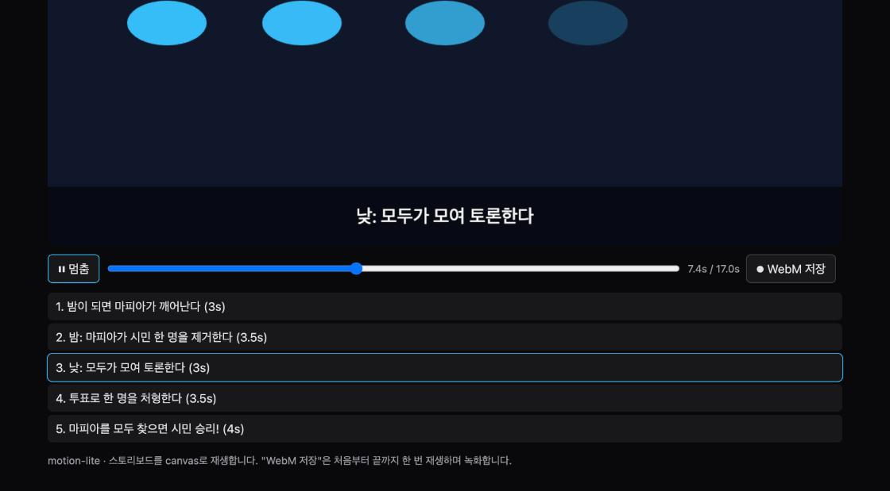

# motion-lite — 한 줄 컨셉 → 애니메이션 설명 영상 (Claude Motion 동네 버전)

## 1. 무엇을 만들었나
Python CLI `motion_lite.py` 하나와 그것이 뱉는 단일 HTML. 컨셉 한 줄을 주면 Claude Haiku 5.5가 `claude -p --json-schema`로 스토리보드 JSON(장면·자막·도형·등장 애니메이션)을 쓰고, 스크립트가 그 JSON을 박은 HTML을 만든다. 브라우저에서 열면 canvas가 16:9로 재생하고(장면 크로스페이드, 자막 띠, 재생/탐색, 장면 목록), "WebM 저장" 버튼이 `canvas.captureStream` + `MediaRecorder`로 처음부터 끝까지 녹화해 내려준다. `--dry-run`은 내장 스토리보드("Claude Code 모드란?")로 모델 없이 렌더한다.



## 2. 왜 만들었나
2026-10-08 [Claude Dashboards와 Claude Motion 베타](https://claude.com/resources/articles/dashboards-and-motion). Motion은 프롬프트로 짧은 애니메이션 설명 영상을 만들어 MP4로 주는데 Team/Enterprise 전용이다. "모델이 영상을 그리는 게 아니라 **구조화된 스토리보드를 쓰고**, 렌더는 코드가 한다"는 구조라면 브라우저 하나로 흉내 낼 수 있겠다 싶었다. 구조화 출력(JSON 스키마)이 어디까지 "디자인"을 받아낼 수 있는지 보는 실험이기도 하다.

## 3. 어떻게 만들었나
1. **스토리보드 스키마**: 장면 2~8개, 장면당 도형 1~10개. 도형은 `rect/circle/text/arrow`, 좌표는 중심 기준 퍼센트, 색은 `#rrggbb`, 등장 효과 `fade/slide-left/slide-up/grow/pulse/none` + `delay_s`. 같은 규칙을 파이썬 `validate_storyboard()`가 다시 검사한다(모델 출력, 사용자가 직접 쓴 JSON 모두).
2. **모델 호출**: `claude -p`에 `--system-prompt`(스토리보드 작가 역할, 배치 규칙), `--json-schema`(위 스키마), `--tools ""`, `--effort low`. 구조화 출력은 응답 JSON의 `structured_output`에 온다. `is_error`면 실패로 처리한다.
3. **렌더**: HTML 템플릿의 `<script type="application/json">`에 스토리보드를 박는다. `</`를 `<\/`로 바꿔 스크립트 탈출을 막고, `_meta`(비용 등)는 뺀다. 외부 리소스 없음.
4. **플레이어**: 장면 시작 시각을 누적해 두고 `requestAnimationFrame`마다 현재 장면과 직전 장면을 0.5초 크로스페이드로 그린다. 도형은 `delay_s` 뒤 0.6초 ease-out으로 등장. 화살표는 w/h 중 긴 축 방향. 라벨 색은 배경 도형의 명도로 자동 대비.
5. **녹화**: `MediaRecorder`가 지원하는 WebM 코덱(vp9→vp8)을 고르고, 처음부터 재생하며 100ms 청크로 모아 끝나면 Blob을 다운로드한다.
6. **확인**: Haiku에게 "마피아 게임 규칙"을 맡겨 5장면 26도형 스토리보드를 14초, $0.0046에 받았고, Chrome에서 열어 재생·크로스페이드·장면 목록 하이라이트·콘솔 오류 없음을 확인했다(위 스크린샷). 그 JSON은 `samples/mafia-rules.json`으로 남겨 test.sh가 매번 다시 렌더한다.

## 4. 사용법
```bash
cd days/2026-10-10-motion-lite
python3 motion_lite.py "프롬프트 캐싱이 왜 싼지: 같은 접두사는 다시 계산하지 않는다"   # Haiku 5.5 → out/<제목>.html
python3 motion_lite.py --dry-run                        # 내장 스토리보드로 렌더 (키·네트워크 불필요)
python3 motion_lite.py --storyboard samples/mafia-rules.json   # 직접 쓴/저장한 JSON으로 렌더
python3 motion_lite.py "..." --save-json --model claude-sonnet-5-5
open out/*.html     # 재생 → "⏺ WebM 저장"으로 영상 파일
```

## 5. 테스트 결과
오프라인 (`bash test.sh`, CI에서도 실행):
```
== 1) python3 -m unittest
  Ran 14 tests  OK      (검증 규칙 10가지 거부·경계값 허용, 스키마-검증기 일치, HTML 자체완결·스크립트 탈출 방지·_meta 제거,
                          slug, dry-run/--storyboard/오류 CLI, 모델 출력 정상·깨짐·is_error 처리)
== 2) dry-run 렌더
  ✅ HTML 생성 (10742 bytes)
== 3) 샘플 스토리보드(samples/*.json)가 모두 유효하고 렌더됨
  ✅ samples/mafia-rules.json
== 결과: PASS
```
실제 Haiku 5.5 (`python3 motion_lite.py "마피아 게임 규칙: …" --save-json`, 2026-10-10):
```
🎬 claude-haiku-5-5에게 스토리보드를 부탁하는 중…
   5장면, 26도형, 14.2s, $0.0046
✅ out/마피아-게임-규칙-스토리보드.html  (5장면, 17.0초)
```
Chrome 확인: 재생 7.4s 시점에 3장면("낮: 모두가 모여 토론한다") 원 네 개가 차례로 떠오르고, 마지막 장면은 "마피아 전멸 → 시민 승리" 카드. 콘솔 오류 0건.

## 6. 한계와 다음 아이디어
- 도형 네 종류와 등장 효과 여섯 개뿐이라 "설명 다이어그램" 수준이다. 이동 경로, 장면 간 도형 연결(같은 id가 다음 장면으로 움직임)을 넣으면 Motion에 가까워진다.
- 소리가 없다. Web Speech API로 자막을 읽어 주거나, 자막 길이에 맞춰 장면 길이를 자동 조정할 수 있다.
- WebM만 저장한다. MP4가 필요하면 ffmpeg로 변환해야 한다.
- 모델이 좌표를 "그려 보지 않고" 쓰므로 글자가 겹칠 때가 있다. 렌더 후 스크린샷을 모델에게 다시 보여 주는 한 번의 수정 루프가 다음 단계다.

## 7. 출처
- Claude Dashboards와 Claude Motion 베타: https://claude.com/resources/articles/dashboards-and-motion
- Claude Code CLI `--json-schema` 구조화 출력: https://code.claude.com/docs/en/cli-reference
- MDN `HTMLCanvasElement.captureStream`, `MediaRecorder`
